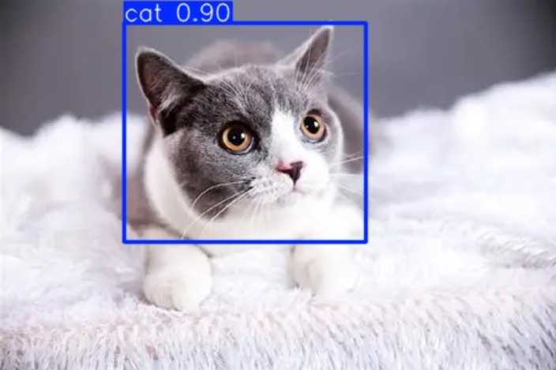
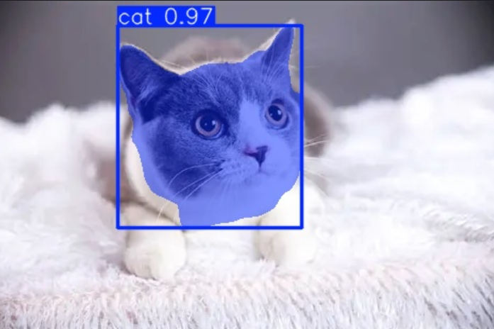
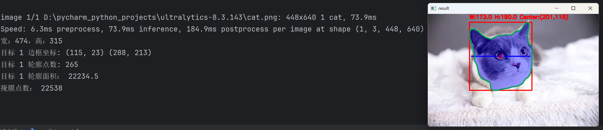

# YOLOv11训练目标检测模型和分割模型

### 环境配置

anaconda yolov11环境(添加到PyCharm Python 解释器)

````
conda create -n yolov11 python=3.10

# nvidia-smi查看cuda版本

# [Get Started](https://pytorch.org/get-		  started/locally/) 查看cuda对应的pytorch版本

```
pip3 install --pre torch torchvision torchaudio --index-url https://download.pytorch.org/whl/nightly/cu129
```
pip install ultralytics

````

labelimg工具环境

```
conda create -n labelimg python=3.8
pip install labelimg
```

labelme工具环境

```
conda create -n labelme_env python=3.9
pip install labelme pyqt5==5.15.7
```

### 分类模型

1. 复制图片到data/images下
2. 使用labelimg工具

OpenDir选择data/images，Change Save Dir选择data/labels

3. 运行data_split.py划分数据集（生成datasets）
4. 更改data.yaml文件中的nc，可选择分类数量

5. yolo11.yaml文件中nc保持与data.yaml一致
6. 运行train.py开始训练（模型在runs/detect/train/weights下）

7. 运行predict.py开始评估（结果在runs/detect/predict下）

### 分割模型

步骤类似训练分类模型，文件名均加了个-seg，特殊步骤：

2. 使用labelme标注数据，打开目录选择data-seg/images，更改输出路径选择data-seg/json

​	运行label_format-seg.py生成data-seg/labels

7. 运行predict-seg.py、predict-seg-info.py开始评估



